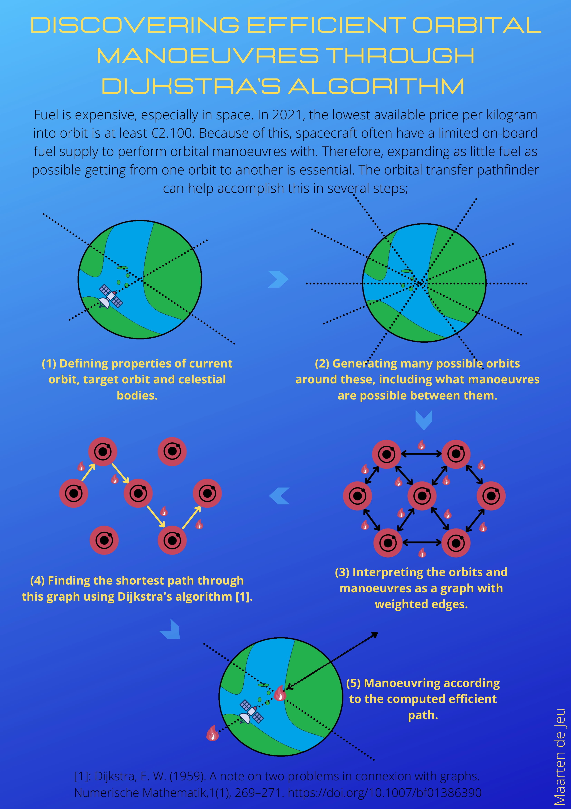

# orbital-transfer-pathfinder
Find the orbital transfers that require the least delta-v to get from one orbit to another.

This project abstracts from reality to limit project scope by implementing a limited amount
of Keplerian elements for orbits. For many real-world problems, like finding good approaches to drastic
inclination-changes, these will be enough. Currently, the following Keplerian elements are implemented:

1. Semi-major axis.
2. Eccentricity.
3. Inclination.

With these Kepler elements, the following types of manoeuvres/burns are implemented:

1. Pure inclination change.
2. Attitude raise/lower burn.
3. Combined inclination and attitude change.

**How to use:**

To find efficient flight-plans between a certain amount of pre-defined orbits around earth, one can use the otp.py script.

If more customization is required, one can program their own script using the classes provided in this package. The example.py script shows how to properly use them to find an efficient flight plan through example.
